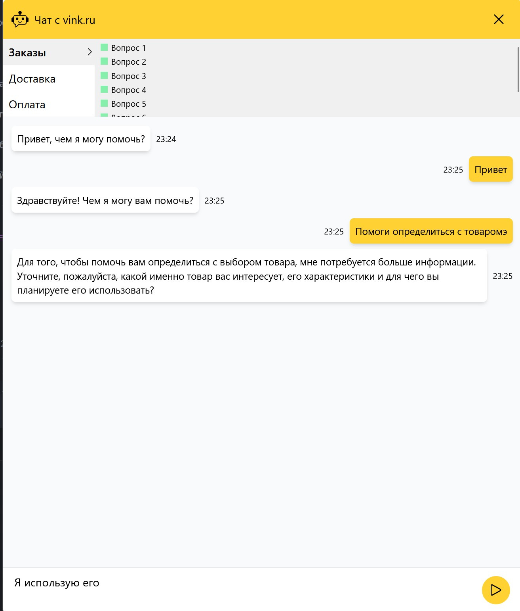

# Хакатон от Яндекс и Vink.RU  

Проект чата с Yandex GPT - это инновационное решение для взаимодействия с посетителями вашего сайта. Он использует мощь искусственного интеллекта от Yandex GPT для обеспечения автоматизированных ответов на запросы пользователей.

## Основные функции

- **Использование Yandex GPT:** Интеграция с Yandex GPT позволяет чату генерировать интеллектуальные ответы на запросы пользователей, что улучшает опыт обслуживания и снижает нагрузку на операторов.

- **Автоматическое переключение на оператора:** Если пользователь запросит помощь или чат не сможет обработать запрос, система автоматически переключится на живого оператора для обеспечения высококачественного обслуживания.

- **Интеграция с веб-сайтом:** Проект чата легко интегрируется с вашим веб-сайтом, обеспечивая плавный и интуитивно понятный интерфейс для пользователей.

- **Пользовательский интерфейс:** Чат обладает удобным пользовательским интерфейсом с возможностью отправки сообщений, получения автоматических ответов и запроса помощи оператора.

- **Адаптивность:** Чат адаптирован для работы на различных устройствах, включая десктопы, планшеты и мобильные телефоны.

## Ссылки:

### Демо: [=> Link Site <=](http://hackathon.zapto.org/) 

### Видео : [=> Link Video <=](https://disk.yandex.ru/i/oFe1ww9htkyEiA) 

## Frontend:

* ✅ React: 18.2.0
* ✅ Typescript: 5.2.2,
* ✅ Redux toolkit: 2.2.2,
* ✅ Redux Persist: 7.51.0,
* ✅ TailwindCSS: 3.4.1,

## Backend:

### Ссылка на бэкенд репозиторий: [=> Link Repositories <=](https://github.com/vink-bot/backend)  

## Сборка и инструменты:

- React Scripts, [Webpack](https://webpack.js.org/): Для сборки и управления модулями.
- [TailwindCSS](https://tailwindcss.com/):  CSS-фреймворк.
- [Prettier](https://prettier.io/), [ESLint](https://eslint.org/): Инструменты для форматирования кода.
- [TypeScript](https://www.typescriptlang.org/) : Язык программирования, добавляющий статическую типизацию к JavaScript.


## Команда:

➡️ Product manager – Сергей Кириллов (ТГ [@Exclussivei](https://t.me/Exclussivei))

➡️ Project manager – Лена Вертинская (ТГ [@lena_vert](https://t.me/lena_vert))

### Frontend:

➡️ Типсин Дмитрий (ТГ [@Chia_Rio_Ru](https://t.me/Chia_Rio_Ru), GitHub [TIPDMR](https://github.com/TIPDMR))


### Backend:

➡️ Александр Мальшаков (ТГ [@amalshakov](https://t.me/amalshakov), GitHub [amalshakov](https://github.com/amalshakov))

➡️ Олег Чужмаров (ТГ [@chtiger4](https://t.me/chtiger4), GitHub [floks41](https://github.com/floks41)


## Развёртывание проекта

- Клонируйте репозиторий через командную строку:

```
git clone https://github.com/vink-bot/frontend
```

- Перейдите в локальную папку с проектом
- Установите зависимости командой:

```
npm i
```
Настройте переменные по пути ./src/shared/lib/const/const.ts
```javascript
// API Backend
export const MAIN_API_URI: string = '//77.232.128.89/api/v1';
// Через какое время считать переписку законченной если не поступали сообщения
export const TIMI_OUT_CHAT_REQUEST: number = 10;
// Максимальное количество попыток получения сообщения с сервера
export const MAX_RETRY_ATTEMPTS_MESSAGE_FROM_SERVER: number = 3;
// Интервал (в миллисекундах) между запросами на сервер для получения сообщений
export const MESSAGE_POLLING_INTERVAL: number = 3;

```
- Запустите приложение:

```
npm run dev
```


## Поддержка Браузеров

| Chrome | Firefox | Edge | Safari | Opera |
|:---:|:---:|:---:|:---:|:---:|
|  |  |  |  |  |

## Фото чата


